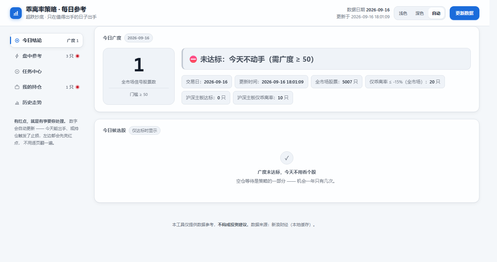

# 乖离率超跌策略工具 · 完整使用文档

> **一句话说明**：这是一个帮你在 A 股"跌得最惨的那几天"挑股票的小工具。
> 它每天只做一件事——算出「今天市场有多恐慌」，恐慌到一定程度才告诉你该动手。
>
> **⚠️ 重要声明：本工具仅提供数据参考，不构成任何投资建议。**
> **股市有风险，任何策略都可能亏损，请自行决策并控制仓位。**

---

## 目录

- [第一部分 · 先认识这个工具](#第一部分--先认识这个工具)
- [第二部分 · 第一次使用（从零到跑通）](#第二部分--第一次使用从零到跑通)
- [第三部分 · 界面逐块详解](#第三部分--界面逐块详解)
- [第四部分 · 三个任务怎么用](#第四部分--三个任务怎么用)
- [第五部分 · 完整操作流程](#第五部分--完整操作流程)
- [第六部分 · 策略规则详解](#第六部分--策略规则详解)
- [第七部分 · 桌面控制台](#第七部分--桌面控制台)
- [第八部分 · 常见问题 FAQ](#第八部分--常见问题-faq)
- [第九部分 · 故障排查](#第九部分--故障排查)
- [第十部分 · 参数调整（进阶）](#第十部分--参数调整进阶)
- [附录](#附录)

---

# 第一部分 · 先认识这个工具

## 1.1 它到底帮你做什么

股票跌了会反弹，这是常识。但问题是：**跌 5% 的股票天天有，跌 20% 的股票也不少，到底哪些值得买？**

这个工具的回答是：**别盯着个股看，先看整个市场。**

它每天收盘后扫描全部 5000 多只 A 股，数一数「今天有多少只股票同时满足下面三个条件」：

1. **跌得够狠**——比 24 天平均价低了 15% 以上
2. **成交放量**——今天的成交量是过去 5 天平均的 1.5 倍以上（说明有人在恐慌性抛售）
3. **还在跌**——最近 5 天是负收益（说明下跌势头没停）

数出来的这个数字，就叫 **「信号广度」**。

> **打个比方**：
> 广度就像"暴雨的降雨量"。
> 毛毛雨（广度 5）——淋湿了就淋湿了，不用管。
> 大暴雨（广度 300+）——全城淹水，雨一停就是抄底的好时机。
> **我们只在"全城淹水"的时候出门捡东西。**

## 1.2 为什么大部分时间它让你什么都不做

这是新手最容易误解的一点，所以单独说：

**这个策略六年（2021-01 ~ 2026-08）里只有 22 个交易日达标，平均每年 3~4 次。**

也就是说，**一年有 240 多个交易日，其中 236 天以上你会看到"今天不动手"。**

这不是工具坏了，这是**设计如此**。

> **打个比方**：
> 这就像一个只在"台风过后"才出门捡便宜货的人。
> 一年 365 天，台风可能就来三四次。
> 剩下的 360 天他都在家里待着——**"不出门"本身就是他的工作**。

**请务必记住**：如果你打开工具，看到灰色数字、看到"今天不动手"，那是**正常状态**。
真正需要你紧张的是——**它突然变红了**。

## 1.3 必须记住的四个数字

| 数字 | 含义 |
|---|---|
| **50** | 出手门槛。广度 ≥ 50 才算"达标"，才需要考虑买 |
| **-6%** | 止损线。收盘价跌破买入价的 -6%，次日开盘卖出 |
| **+6% / +10%** | 止盈线。到 +6% 卖一半，到 +10% 全卖 |
| **10** | 最长持有 10 个交易日，到期就走 |

---

# 第二部分 · 第一次使用（从零到跑通）

## 2.1 需要准备什么

### 必须有的

| 项目 | 说明 |
|---|---|
| **一台电脑** | Windows 电脑（本工具在当前环境验证过 Windows） |
| **Python** | 3.10 或更高版本。WinPython / 官方安装包都行 |
| **网络** | 需要联网下载行情数据（数据来自新浪财经免费接口） |
| **浏览器** | Chrome / Edge 等任意现代浏览器 |

### 需要安装的 Python 库

打开命令行（Windows 下按 `Win + R`，输入 `cmd` 回车），粘贴下面这一行，回车：

```bash
pip install pandas numpy flask akshare requests
```

> **这行命令在做什么？** 它在安装 5 个"零件"，工具需要它们才能工作。
> 装的过程中会刷一堆字，正常。看到最后出现 `Successfully installed ...` 就是成功了。

### 第一次使用要花多久？

| 阶段 | 耗时 |
|---|---|
| 装 Python 和库 | 约 10 分钟 |
| 第一次下载全市场数据 | **约 15~25 分钟**（要下 5000 多只股票的数据） |
| 之后每天更新 | 同样 15~25 分钟（放在后台跑，不用盯着） |

> ⚠️ **第一次会慢，这是正常的。** 因为要把 5000 多只股票的历史数据全下载一遍。
> 之后每天只需要增量更新，还是 15~25 分钟（接口速度所限，不是你的电脑慢）。

## 2.2 第一步：启动工具

### 方法 A：双击桌面图标（最推荐）

桌面上有一个图标叫 **「乖离率策略控制台」**，双击它。

会弹出一个**黑底白字的窗口**（这叫"控制台"），长这样：

```
======================================================================
   乖离率策略 · 控制台　（本地运行，不联网上传）
======================================================================
   工具网站： ○ 已停止
   数据日期： —　今日广度： —　（尚无广度数据）
   定时任务： 全部关闭（网站不会自己定时，需要你到网页上开启）
──────────────────────────────────────────────────────────────────────
   [1] 启动工具网站（自动打开浏览器）
   [2] 关闭工具网站
   [3] 用浏览器打开工具网站
──────────────────────────────────────────────────────────────────────
   [4] 立即执行任务（盘前 / 盘中 / 盘后）
──────────────────────────────────────────────────────────────────────
   [5] 打开使用手册
   [6] 打开数据文件夹
   [7] 创建 / 修复桌面快捷方式
   [0] 退出
──────────────────────────────────────────────────────────────────────
  请输入序号后回车：
```

**操作**：输入数字 `1`，然后按回车键。

**你会看到**：
1. 屏幕上出现 `正在启动工具网站…`
2. 接着 `✔ 启动成功！地址：http://127.0.0.1:8000`
3. **浏览器自动打开**，显示工具的网页界面

> ⚠️ **这个黑色窗口不要关掉！** 它就是工具的"发动机"。
> 关掉它，网页就打不开了。（但可以最小化）

### 方法 B：没有桌面图标怎么办

如果桌面上找不到图标，说明快捷方式丢了。两个办法：

**办法一**：直接进项目文件夹，双击 `webapp` 文件夹里的 **`控制台.bat`**。

**办法二**：打开控制台后（用办法一），按数字 `7` 回车，会自动**重新创建桌面图标**。

**办法三**（最原始）：打开命令行，进入项目目录，运行：
```bash
python webapp/server.py
```
然后手动在浏览器打开 `http://127.0.0.1:8000`。

### 方法 C：网站已经在跑了

如果启动时提示 **"工具网站已经在运行了（端口 8000 被占用）"**，说明它本来就开着。

- 直接在浏览器打开 `http://127.0.0.1:8000` 即可
- 想重启：先在控制台按 `2` 关闭，再按 `1` 启动

## 2.3 第二步：跑第一次数据（最重要的一步）

**刚装好的工具是"空"的**——它还没有任何行情数据，所以网页上会显示"尚无数据"。

你必须先跑一次 **「盘后任务」**，把数据下载下来。

### 怎么跑

**方式一：在网页上跑**

1. 网页往下滚，找到 **「任务中心」** 这一块
2. 找到第三张卡片 **「🌙 盘后任务」**
3. 点它左边那个蓝色的 **「▶ 立即执行」** 按钮

**方式二：在控制台里跑**

1. 回到那个黑色窗口
2. 输入 `4` 回车（进入"立即执行任务"菜单）
3. 输入 `3` 回车（选择"盘后任务"）

### 你会看到什么

开始跑之后，网页上的任务卡片会展开一条**进度条**，文字会实时更新：

```
下载全市场数据
[████████░░░░░░░░░░░░]  1200/5017（成功 1200 失败 0）
```

> **进度条走得很慢是正常的。** 因为要一个个去问数据源要数据。
> 大约每 200 只股票更新一次进度，所以别说"卡住了"——它只是在下数据。

### 要等多久

**约 15~25 分钟。**

> **重要**：跑的过程中你可以：
> - ✅ 最小化浏览器
> - ✅ 关掉浏览器（任务在后台继续跑，跑完结果会存进"执行历史"）
> - ✅ 去做别的事
>
> ⚠️ 但**不要关掉那个黑色控制台窗口**，否则任务会中断。

### 跑完了会看到什么

任务卡片上会出现一句结论，例如：

- `2026-09-14 广度 0 未达标 → 明天不动手。`
- 或者（达标时）`2026-03-23 广度 199 达标 → 明天可以出手！`

同时网页顶部的「今日广度」大数字和下面的曲线图都会更新。

## 2.4 第三步：看懂首页

跑完数据后，网页最上方会出现一个**大数字**：

| 你看到 | 含义 | 你要做什么 |
|---|---|---|
| 🔴 **红色**大数字，≥ 50 | **达标，机会来了** | 看下面的「今日候选股」表格 |
| ⚪ **灰色**大数字，< 50 | **未达标** | 关掉页面，明天再来 |

大数字下面还会有一句话直接告诉你结论，例如：
- `⛔ 未达标：今天不动手（需广度 ≥ 50）`
- `✅ 达标：可以按下方候选股出手`

## 2.5 第一次用最容易遇到的 5 个问题

| 问题 | 原因 | 怎么办 |
|---|---|---|
| 网页显示"尚无数据" | 还没跑过盘后任务 | 按 [2.3 节](#23-第二步跑第一次数据最重要的一步)跑一次 |
| 进度条很久不动 | 数据源响应慢，属正常 | 耐心等，最多 25 分钟 |
| 显示"今天不动手" | 正常状态 | 不用管，明天再来 |
| 浏览器打开是空白页 | 后端还在启动中 | 等 10 秒，页面会自动重试 |
| 提示端口被占用 | 网站已经开着了 | 直接开 `http://127.0.0.1:8000` |

---

# 第三部分 · 界面逐块详解

网页从上到下共 6 块内容，下面逐个说明。



## 3.1 页头（最上面一行）

```
📊 乖离率策略 · 每日参考                       数据日期 2026-09-14
超跌抄底 · 只在"该出手的日子"出手               更新于 2026-09-15 12:26    [更新数据]
```

| 元素 | 说明 |
|---|---|
| **📊 标题** | 工具名称 |
| **数据日期** | ⭐ **最重要**：这些数字是基于哪一天的收盘数据算出来的 |
| **更新于** | 数据是什么时候下载的 |
| **更新数据按钮** | 点它 = 跑一次盘后任务（和任务中心的「盘后任务」效果一样） |

> **⚠️ 一定要先看「数据日期」。**
> 如果它显示的是好几天前，说明你很久没更新数据了，那些数字已经过期。

## 3.2 今日广度（红绿灯）

这是整个页面**最核心的一行**。

```
┌──────────────────┐
│       0          │   ⛔ 未达标：今天不动手（需广度 ≥ 50）
│ 全市场信号股票数   │
│   门槛 ≥ 50      │   交易日：2026-09-14
└──────────────────┘   更新时间：2026-09-15 12:26
                       仅乖离率≤-15%：33 只
                       全市场：5003 只
```

| 元素 | 说明 |
|---|---|
| **大数字** | ⭐ 今日广度。**红色 = 达标；灰色 = 未达标** |
| **判定文字** | 一句话结论，直接告诉你该不该动手 |
| **交易日** | 数据对应的交易日 |
| **更新时间** | 数据下载时间 |
| **仅乖离率≤-15%** | 只看"跌得够狠"这一个条件的股票数（供参考） |
| **全市场** | 当天有交易数据的总股票数 |

> **为什么"仅乖离率"有 33 只，广度却是 0？**
> 因为广度要求**三个条件同时满足**（跌得狠 + 放量 + 还在跌）。
> 33 只虽然跌得狠，但没放量或者已经止跌了，所以不算。
> **这正是这个策略的精选之处。**

## 3.3 任务中心

页面上第二块，标题写着 **「任务中心 · 什么时候跑，由你决定」**。

里面有**三张卡片**（盘前 / 盘中 / 盘后），每张卡片包含：

| 元素 | 说明 |
|---|---|
| **图标 + 名称** | 🌅 盘前任务 / ⏱ 盘中任务 / 🌙 盘后任务 |
| **状态标签** | 「未开启定时」或「定时 09:10」 |
| **▶ 立即执行** | 点一下，马上跑一次 |
| **定时执行 开关** | 勾上 + 保存 = 每天到点自动跑 |
| **时间选择框** | 设定几点跑（例如 `15:35`） |
| **星期勾选** | 设定周几跑（默认周一到周五） |
| **保存定时** | 保存上面的设置 |
| **执行历史**（可展开） | 看过去每一次跑的结果 |
| **结果区** | 显示上次执行的完整结论 |

详细用法见 [第四部分](#第四部分--三个任务怎么用)。

## 3.4 历史广度走势图

一张柱状图，显示**过去 250 个交易日**的广度变化。

| 视觉元素 | 含义 |
|---|---|
| **蓝色/红色柱子** | 每天的信号广度。**红色 = 那天达标了**，蓝色 = 没达标 |
| **橙色虚线** | 出手门槛（50）。柱子超过这条线就是机会 |
| **底部日期** | 横轴，最左最早、最右最新 |

**怎么看这张图**（很有用）：

- 图很平、柱子都很矮 → 市场平静，安心等待
- **突然冒出一根很高的红柱** → ⭐ 机会出现！记下那个日期
- 柱子越高 = 市场越恐慌 = 历史统计的胜率越高

> **看图技巧**：把鼠标想象成一条竖线，从右往左看最近的柱子。
> 如果最近 20 天都是矮矮的蓝柱，说明现在无事发生——这正是绝大多数时候的样子。

## 3.5 今日候选股

**只有在广度达标时才会显示内容**，否则会显示"广度未达标，今天不用看个股。"

达标时，这里会出现一个表格（最多 10 只股票）：

| 列 | 含义 |
|---|---|
| **代码** | 6 位股票代码，如 `300911` |
| **名称** | 股票名称 |
| **现价** | 信号日收盘价 |
| **BIAS** | 乖离率（负得越多 = 跌得越狠）|
| **换手%** | 换手率（越高说明交易越活跃）|
| **量比** | 成交量 / 5 日均量 |
| **近5日%** | 最近 5 天涨跌幅（负数 = 在跌）|
| **成交额(亿)** | 当日成交金额 |

**表格怎么用**：
- 已按 BIAS 从低到高排好（**跌得最狠的排最前面**）
- 买的时候**不必全买**——资金够买几只就买几只，平均分配
- 最多 10 只，单只不超过总资金的 1/10 ~ 1/5

## 3.6 我的持仓

买完股票后，在这里登记，工具会**自动帮你盯着什么时候该卖**。

### 怎么登记

在表单里填 4 项——**填完点「加入持仓」**：

| 填写项 | 说明 | 必填？ |
|---|---|---|
| **股票代码** | 6 位数字，如 `300274` | ✅ 必填 |
| **名称** | 股票名，不填会自动补上 | 可空 |
| **买入日期** | 点日历选择 | ✅ 必填 |
| **买入价** | 你实际成交的价格 | ✅ 必填 |
| **股数** | 买了多少股，不填也行 | 可空 |

> ⚠️ **买入价一定要填对！** 工具用它来算止损线和止盈线。
> 填错了，后面的提示就全错了。

### 登记后会显示什么

表格里出现你那只股票，并自动算出：

| 列 | 含义 |
|---|---|
| **最新价** | 最近一个交易日的收盘价 |
| **盈亏%** | 相对你买入价的盈亏（红涨绿跌） |
| **止损线** | 买入价 × 0.94（跌到这条线就要卖） |
| **止盈1/2** | 买入价 × 1.06 / × 1.10（到这两条线考虑卖） |
| **持有日** | 已经持有几个交易日 |
| **提示** | ⭐ **最重要**：直接告诉你现在该干什么 |

「提示」列会显示这样的内容：
- `正常持有`（灰色）—— 什么都不用做
- `卖出（跌破止损线）`（红色）—— 明天开盘卖
- `卖出一半（+6%）`（橙红）—— 可以考虑落袋
- `全部清仓（+10%）`（橙红）—— 全卖
- `清仓（移动止盈回撤）`（红色）—— 从最高点回撤 3% 了，保住利润
- `到期清仓（满 10 个交易日）`（黄）—— 时间到了

### 卖出后怎么处理

卖掉股票后，点那一行最右边的 **「删除」** 按钮把它删掉即可。

## 3.7 页脚

最下面的免责声明，提醒你 **本工具不构成投资建议**。

请认真对待这句话——工具只是帮你算数据，**买卖决定永远是你自己做的**。

---

# 第四部分 · 三个任务怎么用

工具内置三个任务，对应一天中的三个时段。

## 4.1 🌅 盘前任务（建议 09:10）

**要多久**：几秒钟（不需要下载数据）

**做什么**：给你一张「今日操作清单」

**输出内容**：
1. **要卖什么**——把触发了止损/止盈/到期的持仓列出来
2. **要买什么**——如果昨天广度达标，把候选股列出来
3. **或者告诉你**——"今天不买也不卖，继续空仓等待"

**什么时候用**：每个交易日**开盘前 15 分钟**跑一次。

> **为什么建议早上跑？** 因为你要在开盘时决定动作。
> 这个任务不下载数据，所以几秒就完成，非常适合早上赶时间时用。

## 4.2 ⏱ 盘中任务（建议 14:30）

**要多久**：约 1 秒

**做什么**：只盯着**你持仓的那几只股票**，实时检查是否触发了卖出条件

**输出内容**：每只持仓的实时价格、浮盈浮亏、以及：
- `预警：已达到 +6%`
- `预警：已跌破止损线`
- `预警：从最高点回撤 3%`

**什么时候用**：盘中想看持仓情况时。

> ⚠️ **重要**：盘中任务只是「预警」，不是「执行指令」。
> 本策略的止损/止盈**以收盘价为准**——盘中价格插一下针不算数。
> 看到预警可以先有个心理准备，但**决定要等收盘**。

## 4.3 🌙 盘后任务（建议 15:35）

**要多久**：**15~25 分钟**（要下载全市场数据）

**做什么**：这是**最核心**的任务，做三件事：
1. 下载全市场 5000+ 只股票的最新日线数据
2. 计算今日信号广度
3. 给出结论：明天该不该出手

**输出内容**：
- 达标时：`2026-03-23 广度 199 达标 → 明天可以出手！` + 明日买入候选股 + 操作指引
- 不达标时：`2026-09-14 广度 0 未达标 → 明天不动手。` + 今日数据概览
- 同时完成持仓体检

**什么时候用**：**每个交易日收盘后**（15:30 之后）。

> ⭐ **如果每天只跑一个任务，就跑这个。**
> 它是唯一会更新数据的任务。其他两个任务都是"读"数据，只有它"写"数据。

## 4.4 定时怎么设置

三个任务默认**全部是关闭的**（这是刻意设计，见下）。

想让它自动跑，按下面做：

1. 在任务卡片上找到 **「定时执行」** 前面的方框，**打勾**
2. 在时间框里填时间，例如 `15:35`
3. 勾选星期（默认周一到周五，可以只选某几天）
4. 点 **「保存定时」**
5. 卡片上的状态标签会从「未开启定时」变成「定时 15:35」

想取消？把勾去掉，再点「保存定时」。

### 建议的定时配置

| 任务 | 建议 | 说明 |
|---|---|---|
| 盘前 | **不开定时** | 手动跑更灵活（几秒就完，不费事） |
| 盘中 | **不开定时** | 只有持仓时才需要，手动跑 |
| 盘后 | **开定时，设 15:35** | 每天自动更新数据，省心 |

## 4.5 ★ 为什么"网站不会自己定时"

这是本工具的一个**核心设计原则**，请务必理解：

> **执行权完全在你手上。**

具体表现：
1. **默认全部关闭**——刚装上时，三个任务都不会自动跑
2. **只有你手动打开开关**，它才会到点自动执行
3. **关掉开关 = 永远不自动跑**
4. **电脑关机 / 网站没开时，定时器不工作**

关于第 4 点，这是**故意的**：
假设你晚上 22:00 才打开电脑，如果工具"贴心地"补跑早上 09:10 的盘前任务，那毫无意义（盘前任务要在开盘前才有用）。所以工具设定：**错过超过 1 小时的任务就不再补跑**。

> **换句话说**：如果你想让股票工具在你不知情时自动操作，它不会做。
> 它只会在你**明确开启**的时间点，安静地跑一次数据计算。

---

# 第五部分 · 完整操作流程

## 5.1 每天要做什么（一张图看懂）

```
┌─────────────────────────────────────────────────────────┐
│  收盘后（15:30 之后）                                     │
│  ↓                                                       │
│  跑「🌙 盘后任务」  ← 唯一必须做的事（15~25 分钟）          │
│  ↓                                                       │
│  看「今日广度」大数字                                      │
│  ↓                                                       │
│  ┌──────────────┐          ┌───────────────────────┐    │
│  │ 灰色 < 50    │          │ 红色 ≥ 50             │    │
│  │ 未达标        │          │ 达标！                │    │
│  │ ↓            │          │ ↓                     │    │
│  │ 关掉，明天再来 │          │ 看候选股，准备明天开盘买 │    │
│  └──────────────┘          └───────────────────────┘    │
└─────────────────────────────────────────────────────────┘
```

## 5.2 达标日：从看到信号到买入

假设 9 月 14 日收盘后跑完任务，发现**广度 199，达标**：

### 第 1 步：晚上，看候选股清单

- 网页「今日候选股」表格里出现 10 只股票
- 「盘后任务」的结论里也会列一遍
- **现在就记下来**，或者截图保存

### 第 2 步：次日（9 月 15 日）开盘前，跑「盘前任务」

- 确认一下清单还在，以及有没有持仓要卖
- 花几秒钟

### 第 3 步：开盘后买入

| 要点 | 说明 |
|---|---|
| **时机** | 开盘后买入（不必抢开盘那一秒，观察几分钟更好） |
| **数量** | 最多 10 只。资金不够就买 5 只、3 只，都行 |
| **分配** | **平均分配**。10 万本金买 5 只 → 每只 2 万 |
| **方式** | 分 2~3 批买，不要一次全仓冲进去 |

### 第 4 步：买入后立刻登记

- 在网页「我的持仓」里，**每买一只就登记一只**
- **买入价一定填准确**（这是后面所有提示的基础）
- 登记完，工具就会开始帮你盯盘

## 5.3 持仓期：什么时候卖

登记之后，你每天只需要看「我的持仓」表格里的**「提示」列**。

**五条卖出规则**（按优先级，满足一条就执行）：

| 优先级 | 情况 | 动作 |
|---|---|---|
| 1️⃣ | 收盘价跌破买入价的 **-6%** | **次日开盘全部卖出** |
| 2️⃣ | 涨到 **+10%** | 全部清仓 |
| 3️⃣ | 涨到 **+6%** | 卖出一半 |
| 4️⃣ | 曾涨过 +5% 后，从最高点回撤 **3%** | 全部卖出（保住利润）|
| 5️⃣ | 持有满 **10 个交易日** | 到期全部卖出 |

> **注意 1**：止损用**收盘价**判断，不是盘中价。
> 盘中跌破 -6% 别慌，可能收盘又回来了。**等收盘确认，次日开盘再卖。**
>
> **注意 2**：优先级从高到低。如果一只股票同时跌破止损线又满 10 天，
> 工具会显示「卖出（跌破止损线）」——**止损永远优先**。

## 5.4 卖出后：记录一下

- 卖掉后，在「我的持仓」里点那行的 **「删除」**
- 建议自己另外记一笔（Excel 或笔记本）：买入价、卖出价、盈亏、原因
- 攒够 20 笔之后，你就能对比回测数据，看看实际表现如何

---

# 第六部分 · 策略规则详解

> 这一章解释"为什么这么定"，**不看也不影响使用**，但看了会更踏实。

## 6.1 怎么选出候选股（三个硬条件）

一只股票要同时满足：

| 条件 | 阈值 | 为什么 |
|---|---|---|
| **乖离率 BIAS(24)** | ≤ **-15%** | 比 24 天均价低 15% 以上，说明跌得够狠 |
| **成交量** | ≥ 5 日均量 × **1.5** | 放量说明有恐慌盘在抛售 |
| **近 5 日涨跌幅** | < **0** | 还在跌，没止跌 |
| **成交额** | ≥ **8000 万** | 排除流动性太差的小票 |
| **上市时间** | ≥ **60 个交易日** | 排除刚上市的新股 |
| **其他** | 非 ST / 非退市 / 非北交所 | 排除高风险标的 |

**候选股按 BIAS 从低到高排序**（跌得最狠的排前面），**每天最多取 10 只**。

## 6.2 什么叫"广度达标"

**广度 = 当天全市场同时满足上面条件的股票数量。**

| 广度范围 | 市场状态 | 历史平均收益 | 历史胜率 |
|---|---|---|---|
| 1 ~ 5 | 个别股票利空 | **-1.01%** | 49.9% |
| 6 ~ 20 | 小范围调整 | -0.21% | 56.4% |
| 21 ~ 50 | 板块级调整 | +0.17% | 61.2% |
| **51 ~ 100** | **市场级调整** | **+2.32%** | **77.3%** |
| **101 ~ 300** | **系统性下跌** | **+3.04%** | **77.9%** |
| **301 以上** | **全市场恐慌** | **+6.36%** | **96.1%** |

**注意这个规律**：广度越大，收益越高、胜率越高。**完全单调**。
这就是为什么工具用广度作为"总开关"——**广度不够，后面的数字更好看也不看**。

## 6.3 为什么止损用"收盘价"而不是"盘中价"

这是一个**踩过坑之后改的**规则：

| 方案 | 六年止损触发率 | 问题 |
|---|---|---|
| 盘中跌破 -3% 就卖 | **54.6%** | ❌ 一半以上是"插针"误伤，卖了就反弹 |
| **收盘跌破 -6% 才卖** | **21.8%** | ✅ 避免误伤，且给足波动空间 |

**结论**：盘中看到跌破别急，**等收盘**。收盘确实破了，次日开盘卖。

## 6.4 历史表现（必须诚实地说）

### 达标日（广度 ≥ 50）六年统计

| 指标 | 数值 |
|---|---|
| 胜率 | **85.6%** |
| 平均单笔收益 | **+4.37%** |
| 盈亏比 | 4.81 |
| 出手天数 | 六年 22 天（每年 3~4 次）|

### ⚠️ 但是——请务必读完这一段

1. **收益高度依赖极端崩盘事件**。
   六年里，2025-04（关税冲击）/ 2024-02（小微盘流动性危机）/ 2022-04 三个事件月，
   贡献了 **44.4%** 的信号。

2. **剔除这三个事件月后**：
   - 胜率仍有 **61.5%**
   - 但平均收益只有 **+0.33%**

3. **所以**：请用 **+0.33%** 作为日常心理预期，**不要**用 +4.37%。
   把它当成「大跌时的抄底工具」，**不要**当成「天天赚钱的工具」。

4. **胜率与当年崩盘级别强相关**：

| 年份 | 峰值广度 | 达标日胜率 |
|---|---|---|
| 2022 | 223 | 89.3% |
| 2024 | 465 | 78.2% |
| 2025 | 758 | **98.8%** |
| 2026 至今 | 199 | **62.8%** |

   → 如果某年没出现极端崩盘（比如 2026），**大概率白等一年**。这是正常的，不是工具失效。

## 6.5 买多少（仓位管理）

| 规则 | 建议 |
|---|---|
| 单只股票上限 | 总资金的 **5%**（激进可到 10%）|
| 最多持有 | **10 只** |
| 单只首次买入 | 总资金的 **2.5%** |
| 加仓次数 | 最多 1 次（跌 5% 时加 2.5%）|
| 同行业上限 | 不超过 3 只，合计不超过 15% |

> 这些数字来自配置文件的 `position` 段，你可以在 `strategy_config.json` 里调整。

---

# 第七部分 · 桌面控制台

## 7.1 它是什么

控制台是工具的**"外部操作界面"**——一个黑底白字的菜单窗口。
你可以在不打开网页的情况下，启动/关闭网站、跑任务、查状态。

## 7.2 打开方式

双击桌面图标 **「乖离率策略控制台」**。

如果图标丢了，进项目文件夹双击 `webapp/控制台.bat`。

## 7.3 菜单逐项说明

打开后第一眼你会看到**状态区**：

```
   工具网站： ● 运行中   http://127.0.0.1:8000   进程 9352
   数据日期： 2026-09-14　今日广度： 0 只（门槛 50）→ 未达标
   最近更新： 2026-09-15T12:26:47
   定时任务： 全部关闭（网站不会自己定时，需要你到网页上开启）
```

| 显示项 | 说明 |
|---|---|
| **工具网站** | `● 运行中` 绿点 = 开着；`○ 已停止` = 关了 |
| **进程** | 网站的内部编号，出问题时可以报给技术支持 |
| **数据日期** | 当前数据是哪一天的 |
| **今日广度** | 和网页上那个大数字一样 |
| **定时任务** | 有没有开启自动定时 |

然后是**功能菜单**：

| 输入 | 功能 | 说明 |
|---|---|---|
| `1` | 启动工具网站 | 启动 + 自动打开浏览器 |
| `2` | 关闭工具网站 | 关掉网站（释放端口）|
| `3` | 用浏览器打开工具网站 | 网站已开着时用这个 |
| `4` | **立即执行任务** | 进去后再选 1/2/3 对应盘前/盘中/盘后 |
| `5` | 打开使用手册 | 打开说明文档 |
| `6` | 打开数据文件夹 | 看下载的行情数据 |
| `7` | 创建/修复桌面快捷方式 | 图标丢了就用这个 |
| `0` | 退出 | 关闭控制台 |

> **注意**：选 `4` 跑「盘后任务」时，控制台会**一直显示进度**，你要等它跑完。
> 这时**不要关窗口**。

## 7.4 命令行方式（进阶）

如果你习惯命令行，也可以用：

```bash
python webapp/control.py status           # 查看状态
python webapp/control.py start            # 启动网站
python webapp/control.py stop             # 关闭网站
python webapp/control.py task premarket   # 跑盘前任务
python webapp/control.py task intraday    # 跑盘中任务
python webapp/control.py task postmarket  # 跑盘后任务
python webapp/control.py shortcut         # 重建桌面快捷方式
```

---

# 第八部分 · 常见问题 FAQ

## A. 启动相关

**Q1：双击桌面图标没反应 / 一闪而过？**
A：说明 Python 环境有问题。试试：
1. 进项目文件夹，双击 `webapp/控制台.bat`
2. 如果还是闪退，打开命令行运行 `python webapp/control.py status`，看报什么错

**Q2：黑色窗口关了会怎样？**
A：网页就打不开了（提示"连不上后端服务"）。重新双击图标，按 `1` 启动即可。

**Q3：提示"端口 8000 被占用"？**
A：说明网站已经开着了。
- 直接浏览器打开 `http://127.0.0.1:8000`
- 要重启：控制台按 `2` 关闭 → 再按 `1` 启动

**Q4：能一直开着吗？**
A：可以。网站开着不占什么资源，可以一直挂着。

**Q5：关掉电脑后再打开，要做什么？**
A：重新双击桌面图标 → 按 `1` 启动网站。定时任务需要网站开着才生效。

## B. 数据相关

**Q6：数据多久更新一次？**
A：**由你决定**。默认不会自动更新。跑一次「盘后任务」就更新一次。

**Q7：数据从哪来？要花钱吗？**
A：来自**新浪财经的免费接口**，完全免费。数据都存在你自己电脑上，不上传。

**Q8：为什么更新这么慢（15~25 分钟）？**
A：因为要下载全市场 5000 多只股票的数据，而免费接口有速度限制。这是正常的，不是你的电脑慢。

**Q9：更新一定要收盘后跑吗？**
A：**最好是的**。因为盘中价格还在变，数据不完整。收盘后（15:30 之后）的数据才是最终的。

**Q10：页面显示的数据日期是几天前，有问题吗？**
A：说明你几天没跑盘后任务了。跑一次即可。

**Q11：会不会上传我的数据？**
A：**不会**。所有数据都在本机，不联网上传（只从数据源下载，不上传任何东西）。

## C. 策略相关

**Q12：一直显示"今天不动手"，是不是坏了？**
A：**不是**。这个策略六年只有 22 天达标（每年 3~4 次）。
大部分日子空仓等待是**策略的一部分**，不是故障。

**Q13：广度为什么是 0，但"仅乖离率"有 33 只？**
A：因为广度要求三个条件**同时**满足。"仅乖离率"只看"跌得狠"这一条。

**Q14：能不能每天都买？**
A：不建议。历史数据显示：**不设门槛时六年平均收益是 -0.21%（亏损）**，
设门槛后才是正的。广度门槛是这个策略的**核心价值**，不是摆设。

**Q15：门槛能调吗？**
A：能。见 [第十部分](#第十部分--参数调整进阶)。

**Q16：一个信号都没有的时候，我该干什么？**
A：**什么都不做**。这正是策略设计的样子——等待本身就是工作的一部分。

## D. 持仓相关

**Q17：买了股票没登记会怎样？**
A：工具不知道你有这只股票，就不会给你卖出提示。**买了一定要登记。**

**Q18：买入价填错了怎么办？**
A：删掉那行，重新填一遍。

**Q19：卖了一半（+6% 那档）之后怎么记录？**
A：目前工具按"整体一只股票"处理。可以先把卖出的部分删掉，再按剩余仓位重新登记。

**Q20：能看到已经卖掉的股票记录吗？**
A：目前网页只显示"持有中"的持仓。已平仓的记录保存在数据库里（`webapp/data.db`）。

**Q21：表格里的"持有日"是什么？**
A：从你买入那天到今天，这只股票实际经历了几个交易日（不含停牌）。

## E. 任务相关

**Q22：三个任务有什么区别？**
A：见 [第四部分](#第四部分--三个任务怎么用)。最简单记法：**只有盘后任务会更新数据，另外两个只是读数据。**

**Q23：为什么网站不自动跑任务？**
A：这是**刻意设计**——执行权归你。见 [4.5 节](#45--为什么网站不会自己定时)。

**Q24：设了定时但没跑？**
A：检查这四点：
1. 网站是不是开着（关了就不跑）
2. 开关是不是真的勾上了（勾完要点「保存定时」）
3. 当天的星期有没有勾选
4. 是不是错过了太久（超过 1 小时不补跑）

**Q25：任务跑到一半能关网页吗？**
A：可以。任务在后台跑，关掉浏览器不影响。跑完结果存在「执行历史」里。

**Q26：怎么知道任务跑完了？**
A：任务卡片上会显示进度条，跑完后自动变成结论。也可以展开「执行历史」查看。

## F. 其他

**Q27：这个工具会自己买卖股票吗？**
A：**完全不会**。它只做数据计算，**不会连接任何券商账户，不会下单**。
所有买卖操作都必须你手动在券商 App 里完成。

**Q28：手机上能用吗？**
A：工具运行在你的电脑上，只能在本机浏览器访问。手机要看的话，需要一些网络设置（不推荐折腾）。

**Q29：换电脑了怎么办？**
A：把项目文件夹拷过去，装好 Python 库，跑一次「盘后任务」重新下载数据即可。

---

# 第九部分 · 故障排查

## 9.1 网页打不开 / 一直转圈

| 检查 | 处理 |
|---|---|
| 控制台是否显示"● 运行中" | 不是的话按 `1` 启动 |
| 地址是不是 `http://127.0.0.1:8000` | 注意是 `127.0.0.1`，不是别的 |
| 等 10 秒再看 | 页面自带重试，后端启动需要几秒 |

## 9.2 显示"连不上后端服务"

说明后端进程没了。到控制台按 `1` 重新启动。

## 9.3 数据数字感觉不对

按顺序检查：

1. **先看「数据日期」**——是不是过期了？
2. 跑一次「盘后任务」重新计算
3. 还不对？看看「全市场」那个数字——正常应该是 **5000 左右**。
   如果只有几十或几百，说明数据下载不完整，重跑一次盘后任务。

## 9.4 任务卡住不动了

- 盘后任务最多 25 分钟，**先耐心等**
- 超过 40 分钟还没动：
  1. 控制台按 `2` 关闭网站
  2. 再按 `1` 重新启动
  3. 重新跑一次任务

> 工具内置了超时保护，正常情况下不会永久卡死。

## 9.5 端口被占用

控制台按 `2` 关闭，再按 `1` 启动。

如果按 `2` 提示"找不到进程"，可能是别的程序占用了 8000 端口。

## 9.6 桌面图标不见了

控制台按 `7` 重新创建。

## 9.7 想彻底重来

1. 关掉网站（控制台按 `2`）
2. 删除 `webapp/data.db`（持仓和任务记录会清空）
3. 如果想连数据一起重下，删除 `data_long` 文件夹
4. 重新启动 + 跑盘后任务

> ⚠️ **删之前先确认没有重要的持仓记录。**

---

# 第十部分 · 参数调整（进阶）

## 10.1 改出手门槛

门槛是这个策略最重要的参数。配置文件在**项目根目录**的 `strategy_config.json`。

**改法**：用记事本打开它，找到这一段：

```json
"regime_gate": {
    "enabled": true,
    "presets": {
      "main": { "threshold": 50, ... },
      "loose": { "threshold": 20, ... },
      "aggressive": { "threshold": 100, ... }
    },
    "active_preset": "main",     ← 改这里
```

把 `"active_preset": "main"` 改成 `"loose"` 或 `"aggressive"`，保存。

**改完要重启网站**（控制台按 `2` 再按 `1`）才生效。

## 10.2 三档门槛对照

| 档位 | 门槛 | 六年达标天数 | 每年机会 | 胜率 | 平均收益 |
|---|---|---|---|---|---|
| `loose`（宽松） | **20** | 46 天 | 7.7 次 | 82.1% | +3.78% |
| **`main`（推荐）** | **50** | 22 天 | 3.7 次 | **85.6%** | **+4.37%** |
| `aggressive`（激进） | **100** | 15 天 | 2.5 次 | 87.8% | +4.84% |

**怎么选**：

| 你的偏好 | 建议档位 |
|---|---|
| 想多几次机会，能接受低一点胜率 | `loose` |
| **不确定就选这个** | `main` |
| 只要最有把握的，宁可少出手 | `aggressive` |

> ⚠️ **提醒**：无论哪一档，请记住 [+6.4 节](#64-历史表现必须诚实地说) 的诚实边界——
> 剔除三大崩盘事件月后，平均收益只有 +0.33%。

## 10.3 其他可调参数

同一个文件里还有：

| 参数 | 位置 | 默认值 | 说明 |
|---|---|---|---|
| 乖离率阈值 | `signal.bias_threshold_default_pct` | -15 | 改小（如 -20）会更严格 |
| 放量倍数 | `signal.volume_ratio_min` | 1.5 | 改大要求更放量 |
| 止损比例 | `hard_stop_loss_pct` | -6 | 改小止损更早 |
| 止盈档位 | `take_profit_tiers_pct` | [6, 10] | 两档止盈的百分比 |
| 最长持有 | `max_hold_days` | 10 | 持有天数上限 |

> ⚠️ **强烈建议**：这些数字都是**六年回测验证过**的。如果你要改，**一次只改一个**，
> 然后观察至少 20 笔交易再决定是否保留。

## 10.4 不建议自己改的

- `webapp/` 里的 `.py` 文件（程序代码）
- `data_long/` 里的数据文件

---

# 附录

## A. 项目目录结构

```
股票工具/
├── webapp/                        ← 工具程序（核心）
│   ├── strategy_core.py           核心引擎：数据获取、指标计算、广度计算
│   ├── updater.py                 数据更新器
│   ├── tasks.py                   任务引擎（盘前/盘中/盘后）
│   ├── server.py                  后端服务
│   ├── db.py                      数据库操作
│   ├── control.py                 控制台程序
│   ├── 控制台.bat                 控制台入口
│   ├── app.ico                    图标
│   ├── data.db                    你的数据（广度/持仓/任务记录）
│   ├── universe.csv               股票清单
│   └── webui/index.html           网页界面
│
├── data_long/                     ← 行情数据（约 1.2GB，可重下）
│
├── 使用文档.md                     ← 本文件
├── 工具站-使用手册.md              简明版手册
├── 傻瓜版-超跌抄底策略.md          策略大白话版
├── A股乖离率超跌反弹策略说明书.md   策略完整版
├── 回测报告-全量第二轮.md          六年回测详细结果
├── 回测报告-第一轮.md              第一轮回测
├── 代码审查与修复报告.md           工程质量审查记录
├── 工具站-开发完成报告.md          技术实现说明
├── 每日广度过检-操作卡.md          手工操作卡（备用）
├── BNF乖离率选股工具-调研与实施方案.md  数据源调研
├── strategy_config.json           ⭐ 策略参数（改门槛改这里）
├── README.md                      项目说明
│
└── backtest_*.py / analyze_*.py   回测与统计脚本
```

## B. 核心文件说明

| 文件 | 作用 | 你要碰吗 |
|---|---|---|
| `控制台.bat` | 控制台入口 | ⭐ 常用 |
| `strategy_config.json` | 策略参数 | 进阶时改 |
| `webapp/data.db` | 你的持仓和记录 | 不用碰（删了会清空）|
| `data_long/` | 行情数据 | 不用碰 |
| 其他 `.py` 文件 | 程序代码 | 不用碰 |

## C. 术语表

| 术语 | 通俗解释 |
|---|---|
| **乖离率 / BIAS** | 股价偏离平均线的百分比。负得越多说明跌得越狠 |
| **信号广度** | 全市场同时满足"跌得狠+放量+还在跌"的股票数量 |
| **门槛** | 广度要达到多少才算"达标"（默认 50）|
| **达标日** | 广度 ≥ 门槛的那一天 |
| **达标** | 同上 |
| **候选股** | 达标日选出来的、可以买的股票 |
| **止损** | 亏到一定程度就卖，防止亏更多 |
| **止盈** | 赚到一定程度就卖，落袋为安 |
| **移动止盈** | 从最高点回落一定幅度就卖，保住利润 |
| **前复权** | 一种价格调整方式，让历史价格能直接比较 |
| **盘前 / 盘中 / 盘后** | 开盘前 / 交易时间内 / 收盘后 |

## D. 一张纸速查卡

**每天**：跑「盘后任务」→ 看大数字。

| 大数字 | 动作 |
|---|---|
| 🔴 ≥ 50 | 看候选股，明天开盘买 |
| ⚪ < 50 | 关掉，明天再来 |

**买入**：次日开盘，最多 10 只，平均分配，分 2~3 批。

**卖出**（看「我的持仓」的提示列）：

| 触发 | 动作 |
|---|---|
| 收盘跌破 -6% | 次日开盘全卖 |
| 到 +6% | 卖一半 |
| 到 +10% | 全卖 |
| 曾涨过 +5% 后回撤 3% | 全卖 |
| 持有满 10 个交易日 | 全卖 |

**永远记住**：大部分日子什么都不做，是**正常的**。

---

## 免责声明

本工具为个人量化研究项目，**仅用于技术学习与数据分析**。

- **不构成任何投资建议**，不构成任何形式的要约或承诺
- 历史回测结果**不代表未来收益**，任何策略在实际交易中均可能产生亏损
- 本工具**不连接券商、不会自动下单**，所有交易决策由使用者自行做出
- 使用者应自行承担全部决策风险，作者不对任何投资损失负责

**股市有风险，入市需谨慎。**
